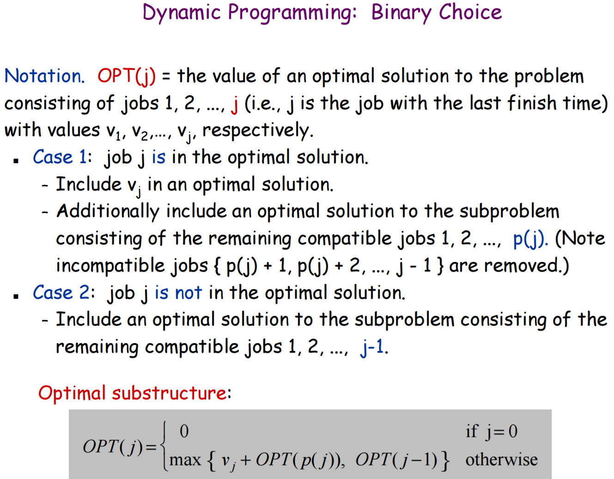

# Weighted Interval Scheduling
The classic introduction to Dynamic Programming

## Problem Statement
Jobs have an ID, start time, a finish time & a value (or weight)  
**Find the maximum weight subset of mutually compatible jobs.**  
2 jobs are **Compatible** if they don't overlap (1 job cannot start before the other job finishes)  

## Optimal Substructure

## Input Jobs
  
For example: job `6` is compatible with job `3` & `2`. Jobs `1`, `4` & `5` are incompatible because they finish after job `6` starts and jobs `7` & `8` are incompatible because they start before job `6` ends (the algorithm presorts jobs by finish time so `7` & `8` are never considered when looking for compatible jobs)  
Job `2` has **no compatible jobs** since none finish before job `2` starts. **The algorithm returns `0` when no compatible job index is found**  
**Finding the next job compatible with job `i` involves looking earlier in the jobs array for a job that finishes before or at the same time as job `i`**

## Pseudocode
  

## Runtime
**O(n log(n) )** from sorting jobs by finish time and binary search in `latestCompatible()`  
Binary Search is O(log n) and there are **n** jobs, so **O(n log(n) )**

## Solution (Jobs Selected in Optimal Subset)
  
#### Optimal Subset is **Job `2` & Job `6`**      **Maximum Value = 5 + 7 = 12**

## Usage
- A 2D array of `inputJobs[][]` created in `main()`
- Each `inputJobs[i]` is an array of 4 numbers  
**[ID, startTime, finishTime, value]**
- `inputJobs[0]` must be a placeholder array of four 0's: `{0,0,0,0}`

## Code Details
- 2D `jobs[]` array is sorted by finish time so the ID's of jobs are no longer the array indexes  
`findSolutionIterative()` uses `jobs[jobIndex][0]` to get the original **ID** of the job
- This allows the rest of the code to just use array indexes in `jobs[][]` when finding the optimal value
- `findSolutionRecursive()` works, but is not used. The recursion has been converted to a loop-based method `findSolutionIterative()`  
(Both versions are left in to show the similarities)
- Comparisons in `latestCompatible()` are made with `<=` since a job `x` can be **compatible** with job `i` if `x` finishes at exactly the same time as `i` starts
  - `latestCompatible()` uses **binary search** to find the index of the job with the latest finish time that is compatible with job `i`
  - `latestCompatible()` Returns `0` if no compatible job was found. This allows the dynamic programming loop to add the value of `jobs[0][0]` (which is `0`) to the `memo[]` array, so this placeholder job does not affect the rest of the schedule, only when no compatible jobs are found
  - `jobs[0][0]` is also used in `findSolutionIterative()` for the **base case**
- `getJobInfo()` converts an `int` job index in `jobs[][]` (sorted by finish time) to a `String` with the job ID, Start Time, Finish Time & Value human-readable

## References
- [Design and Analysis of Algorithms I - Larry Ruzzo, University of Washington](https://courses.cs.washington.edu/courses/cse521/13wi/slides/06dp-sched.pdf)
- [GeeksForGeeks Weighted Job Scheduling](http://www.geeksforgeeks.org/weighted-job-scheduling/)
- [GeeksForGeeks Weighted Job Scheduling in O(n Log n)](http://www.geeksforgeeks.org/weighted-job-scheduling-log-n-time/)
